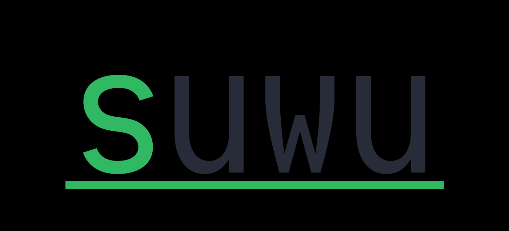
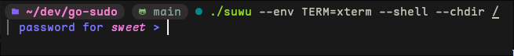

<p></p>
<p align="center">
  
</p>

A simple and minimal implementation of a privelage escalation tool similar to
`sudo`, `su` or `doas`.



## Examples
```sh
# run  a shell as root user
suwu --shell
# run  a shell as a specific user
suwu --shell --user=$USER
# run  a shell as a specific group
suwu --shell --group=$GROUP_NAME
# preserve the environment of the current shell
suwu -E -- ls -lah /
# pass environment variables to the following command
suwu --env TERM=xterm --env MY_SECRET=xyz123 --user=nobody /bin/bash
# change directory for command
suwu --chdir / --shell
# terminate flag parsing with a double-dash
suwu -E -- ls -1 | xargs echo
```
## Installation
- Using just with Go, install instructions here: 
```sh
just
```

- Using the bash script (requires go)
```sh
./build.sh
```

or grab a binary from releases

## Todo
- add credential caching
- add a config file
- use pinentry or zenity as a GUI option to enter password
- be cross-platform (Linux/Windows/Mac/BSD)
- honor the sudoers file or a similar version of that file
