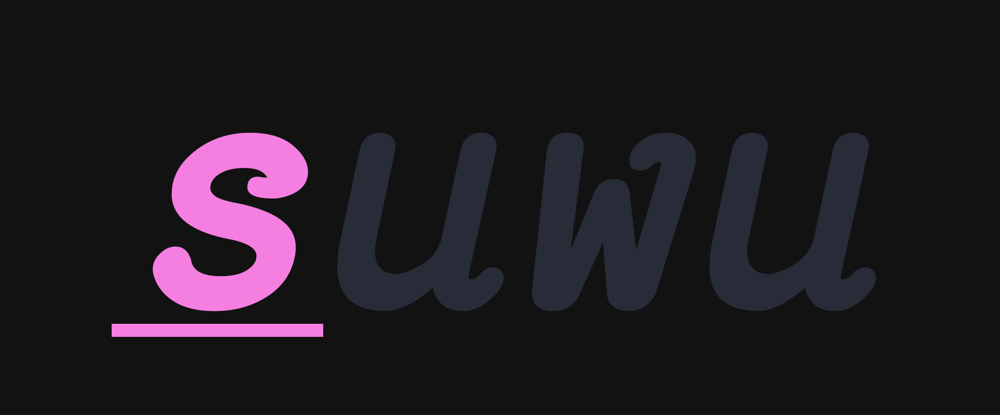

<p></p>
<p align="center">
  
</p>

A very simple and very minimal implementation of a privelage escalation tool similar to
`sudo`, `su` or `doas`.

## Examples
```sh
# run  a shell as a specific user
suwu --shell --user=root
suwu --shell --user=$USER
# preserve the environment of the current shell
suwu -E -- ls -lah /
# pass environment variables to the following command
suwu --env TERM=xterm --env MY_SECRET=xyz123 --user=nobody /bin/bash
```
## Installation
## Features
